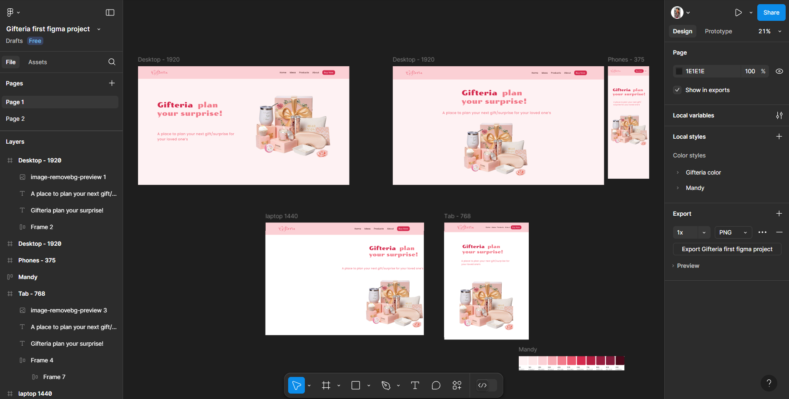

# Learning Figma to Code

- This is a Figma tutorial project where I have learned how to  design your UI in Figma and convert it to a coding project.
- The design of the figma file is provided below and its project will be found in the current *./* directory.

link :- *https://www.figma.com/design/mixA4Pcva1tHkV3V7CVWmW/Gifteria-first-figma-project?node-id=0-1&node-type=canvas&t=ClqOrjtuyP4uSew2-0*

**image :- **
